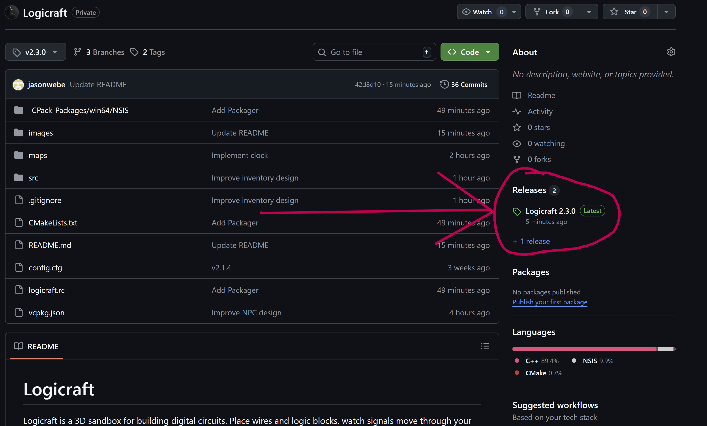

<p align="center">
  
</p>

<h1 align="center">Logicraft</h1>

<p align="center">
  <strong>Construisez vos circuits. Donnez vie à vos idées.</strong><br>
  Un bac à sable 3D où l’électronique devient un terrain de jeu.
</p>

<p align="center">
  <a href="#installation">Jouer</a> ·
  <a href="#ce-que-vous-pouvez-créer">Créer</a> ·
  <a href="#contribuer">Contribuer</a>
</p>


## Imaginez. Construisez. Testez.

Logicraft est un jeu de construction 3D dédié aux circuits numériques. Assemblez des portes logiques, faites circuler les signaux et transformez vos idées en machines fonctionnelles — le tout dans un monde que vous pouvez façonner bloc par bloc.

Que vous souhaitiez comprendre les bases de la logique numérique ou concevoir des systèmes ambitieux, Logicraft vous donne les briques pour expérimenter librement, observer instantanément le résultat et apprendre en construisant.

## Pourquoi Logicraft ?

- **Une électronique concrète** : voyez les signaux se propager et comprenez chaque étape du circuit.
- **Une liberté de construction** : mélangez architecture, décoration et logique pour créer des machines lisibles et originales.
- **Un terrain d’expérimentation** : testez, modifiez et recommencez sans limite.
- **Des exemples prêts à explorer** : découvrez la carte `maps/syslog.bulldog`, avec plusieurs circuits et un compteur à 7 segments.

## Ce que vous pouvez créer

- Compteurs, horloges et minuteries
- Additionneurs, décodeurs et multiplexeurs
- Circuits combinatoires et séquentiels
- Afficheurs LED et écrans 7 segments
- Gadgets interactifs et machines entièrement personnalisées

## Les blocs logiques


- Fils, bouton, LED et panneau
- AND, OR, NOT et XOR
- Bascule D
- Additionneur
- Séparateur et fusionneur
- Décodeur et multiplexeur
- Comparateur
- Horloge

## Les blocs du monde

Herbe, terre, pierre, bois, feuilles, eau, planches, sable et verre : construisez un environnement à la hauteur de vos circuits.

## Installation

### Joueurs — Windows 64 bits

1. Téléchargez l’installateur Windows depuis la page [GitHub Releases](https://github.com/Jzn-wbr/messercraft/releases).
2. Lancez `Logicraft-...-win64.exe`.
3. Démarrez le jeu depuis le menu Démarrer ou le raccourci du bureau.

Vous n’avez besoin que du fichier `.exe`.



## Commandes

| Action | Touche |
| --- | --- |
| Regarder autour de soi | Souris |
| Se déplacer | `W/A/S/D` ou `Z/Q` (AZERTY) |
| Sauter | `Espace` — deux appuis pour voler |
| Descendre en mode vol | `Maj` |
| Casser un bloc | Clic gauche |
| Poser un bloc / actionner un bouton / modifier un panneau | Clic droit |
| Changer de case rapide | Molette |
| Sélectionner une case | `1` à `8` |
| Ouvrir l’inventaire | `E` |
| Ouvrir les réglages d’un bloc | `Q` |
| Revenir au point de départ | `R` |
| Plein écran | `F11` |
| Menu pause / fermer une fenêtre | `Échap` |

## Cartes et sauvegardes

Appuyez sur `Échap`, puis choisissez **SAVE / LOAD** pour ouvrir le menu des sauvegardes.

- **Create** crée une nouvelle carte avec le nom saisi.
- **Overwrite** remplace la sauvegarde sélectionnée.
- **Load** ouvre la sauvegarde sélectionnée.

---

## Contribuer

Vous souhaitez améliorer Logicraft, ajouter des blocs ou proposer une nouvelle idée ? Les contributions sont les bienvenues. Ouvrez une issue pour partager votre proposition ou une pull request pour soumettre directement une amélioration.

### Compiler depuis les sources — Windows

Prérequis :

- CMake 3.21+
- vcpkg (par exemple `C:\\vcpkg`)
- Visual Studio Build Tools 2022 (`cl.exe`)

Configurer et compiler dans PowerShell :

```powershell
cmake -B build -S . -G "Visual Studio 17 2022" -A x64 `
  -DCMAKE_TOOLCHAIN_FILE="C:/vcpkg/scripts/buildsystems/vcpkg.cmake" `
  -DVCPKG_TARGET_TRIPLET=x64-windows

cmake --build build --config Release
```

Lancer le jeu :

```powershell
.\build\Release\logicraft.exe
```

### Créer l’installateur

NSIS est nécessaire pour générer l’installateur avec CPack.

```powershell
cmake -S . -B build
cmake --build build --config Release
cpack -C Release --config build\CPackConfig.cmake
```

L’installateur sera créé dans `build`.

## Structure du projet

- `src/` : code C++
- `images/` : textures et visuels
- `maps/` : cartes sauvegardées (`.bulldog`)
- `config.cfg` : configuration utilisateur
- `CMakeLists.txt` et `vcpkg.json` : compilation et dépendances
- `build/` : fichiers générés par CMake (ignorés par Git)

## Notes techniques

SDL2 et GLEW sont liés dynamiquement par défaut. Leurs DLL sont copiées à côté de l’exécutable afin que le jeu fonctionne sans configuration supplémentaire.

Pour désactiver la copie des DLL, utilisez `-DVCPKG_APPLOCAL_DEPS=OFF` et ajoutez `C:\\vcpkg\\installed\\x64-windows\\bin` au `PATH`, ou choisissez le triplet statique `x64-windows-static`.
